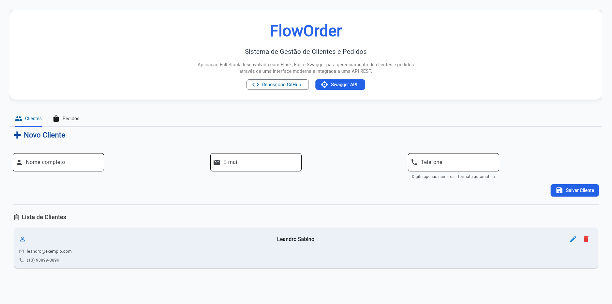
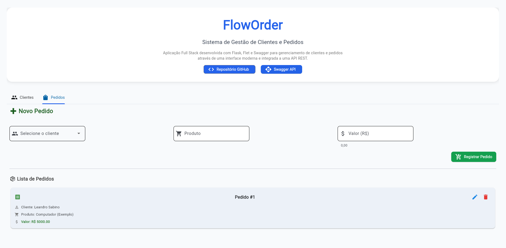

<div align="center">

# FlowOrder

Sistema de gerenciamento de clientes e pedidos desenvolvido com Python, Flask e Flet.


</div>

---

## Sobre o Projeto

O FlowOrder é uma aplicação Full Stack para gerenciamento de clientes e pedidos.

O sistema foi desenvolvido com foco em aprendizado de desenvolvimento web, integração entre frontend e backend, organização de código e construção de APIs REST utilizando Flask.

Atualmente os dados são armazenados em memória utilizando estruturas Python, permitindo testes e desenvolvimento rápido da aplicação.

---

## Demonstração

### Interface do Sistema





---

## Funcionalidades

### Dashboard

- Visualização geral do sistema
- Indicadores de clientes cadastrados
- Indicadores de pedidos registrados

### Clientes

- Cadastro de clientes
- Consulta de registros
- Atualização de informações
- Exclusão de clientes

### Pedidos

- Cadastro de pedidos
- Consulta de pedidos
- Associação entre clientes e pedidos
- Exclusão de pedidos

### API REST

- Endpoints para gerenciamento de clientes
- Endpoints para gerenciamento de pedidos
- Integração com frontend Flet

---

## Arquitetura

```text
┌─────────────┐
│    Flet     │
│  Frontend   │
└──────┬──────┘
       │ HTTP Requests
       ▼
┌─────────────┐
│    Flask    │
│   REST API  │
└──────┬──────┘
       │
       ▼
┌─────────────────────┐
│ Armazenamento Local │
│   (Memória RAM)     │
└─────────────────────┘
```

---

## Tecnologias Utilizadas

### Backend

- Python
- Flask
- Flask-CORS

### Frontend

- Flet
- Requests

### Ferramentas

- Git
- GitHub
- Visual Studio Code

---

## Estrutura do Projeto

```text
FlowOrder
│
├── backend
│   ├── app.py
│   ├── clientes_blueprint.py
│   ├── pedidos_blueprint.py
│   ├── models.py
│   └── storage.py
│
├── frontend
│   └── floworder_app.py
│
├── landing_page
│   ├── index.html
│   └── screenshot.png
│
├── venv
│
├── .gitignore
│
└── README.md
```

---

## Instalação

### 1. Clonar o repositório

```bash
git clone https://github.com/Leandro-dsm/FlowOrder.git
```

### 2. Entrar na pasta do projeto

```bash
cd FlowOrder
```

### 3. Criar ambiente virtual

Windows:

```bash
python -m venv venv
venv\Scripts\activate
```

Linux/Mac:

```bash
python3 -m venv venv
source venv/bin/activate
```

### 4. Instalar dependências

```bash
pip install flask flask-cors flet requests
```

Ou:

```bash
pip install -r requirements.txt
```

---

## Executando o Projeto

### Iniciar o Backend

Abra um terminal na pasta backend:

```bash
cd backend
python app.py
```

Servidor disponível em:

```text
http://127.0.0.1:5000
```

---

### Iniciar o Frontend

Abra outro terminal:

```bash
cd frontend
python floworder_app.py
```

---

### Executar a Landing Page

Abra o arquivo:

```text
landing_page/index.html
```

ou utilize uma extensão como Live Server no VS Code.

---

## Endpoints da API

### Clientes

| Método | Endpoint | Descrição |
|----------|----------|----------|
| GET | /clientes | Lista clientes |
| POST | /clientes | Cadastra cliente |
| PUT | /clientes/<id> | Atualiza cliente |
| DELETE | /clientes/<id> | Remove cliente |

### Pedidos

| Método | Endpoint | Descrição |
|----------|----------|----------|
| GET | /pedidos | Lista pedidos |
| POST | /pedidos | Cadastra pedido |
| PUT | /pedidos/<id> | Atualiza pedido |
| DELETE | /pedidos/<id> | Remove pedido |

---

## Objetivos de Aprendizagem

Este projeto foi desenvolvido para praticar:

- Desenvolvimento Full Stack
- APIs REST com Flask
- Arquitetura cliente-servidor
- Integração entre frontend e backend
- Organização de projetos Python
- Estruturas de dados
- Boas práticas de programação

---

## Possíveis Melhorias Futuras

### Banco de Dados
- [ ] Persistência de dados com SQLite
- [ ] Integração com SQLAlchemy

### Segurança
- [ ] Autenticação de usuários
- [ ] Controle de permissões

### Relatórios
- [ ] Geração de relatórios em PDF
- [ ] Exportação para Excel

### Interface
- [ ] Dashboard avançado com métricas e gráficos

### Infraestrutura
- [ ] Deploy em nuvem
- [ ] Testes automatizados
---

## Autor

Leandro Sabino Sueoka

Estudante de Desenvolvimento de Software Multiplataforma (DSM)

GitHub: https://github.com/Leandro-dsm

LinkedIn: https://www.linkedin.com/in/leandrosueoka/
---

## Licença

Projeto desenvolvido para fins acadêmicos e educacionais.
